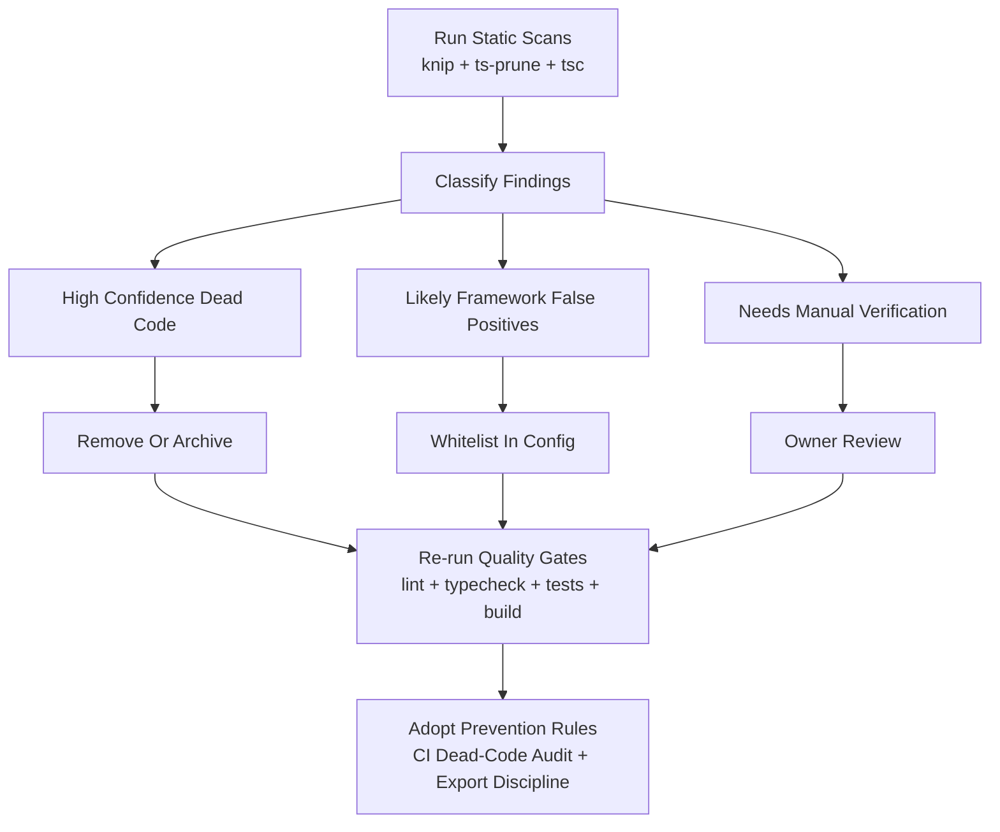

## Codebase Audit Report (Dead Code, Import/Export Reachability, Redundancy)

- **Repository**: `DigitalHerencia/CtrlPlus`
- **Branch**: `main`
- **Date**: 2026-04-05
- **Audit type**: Read-only (no code changes)

## Scope and Objective

This audit focuses on identifying code that appears unused, unreferenced, duplicated,
redundant, or otherwise non-contributing, with emphasis on:

- unused functions, types, interfaces, schemas, constants, DTOs, transactions,
  parameters, and variables
- unused modules/components/features/fetchers/actions through import-export analysis
- duplicates, conflicts, and improper redundancy

## Methodology

The analysis combines static tooling, targeted lint/type checks, and delegated
subagent validation:

- `knip` (unused files, unused exports/types, duplicate exports, dep hygiene)
- `ts-prune` (unused exports map, with framework caveats)
- `tsc --noUnusedLocals --noUnusedParameters`
- `eslint` override for `@typescript-eslint/no-unused-vars`
- delegated reachability review subagent for false-positive filtering

## Executive Summary

| Area                                                          | Result |
| ------------------------------------------------------------- | -----: |
| Unused files (knip)                                           |    102 |
| Unused exports (values/functions)                             |    112 |
| Unused exported types/interfaces                              |     42 |
| Duplicate export pairs                                        |      6 |
| Unused functions (from unused exports)                        |     58 |
| Unused values/constants (from unused exports)                 |     54 |
| Unused interfaces                                             |     27 |
| Unused types                                                  |     15 |
| Confirmed unused local variable/function symbol via TS/ESLint |      1 |
| Unused dependencies                                           |     10 |
| Unused devDependencies                                        |      5 |

## Remediation Flow



## Detailed Findings

### Unused symbols (functions/types/interfaces/constants/DTO-adjacent)

#### Unused functions (58)

Examples:

- `requireAuth` (`lib/auth/session.ts`)
- `getPlatformDashboard` (`lib/fetchers/platform.fetchers.ts`)
- `getWebhookOperationsOverview` (`lib/fetchers/platform.fetchers.ts`)
- `ensureInvoice` (`lib/actions/billing.actions.ts`)
- `getPreviewsByWrap` (`lib/fetchers/visualizer.fetchers.ts`)
- `pruneOldPreviews` (`lib/actions/platform.actions.ts`)
- `cleanupStaleWebhookLocks` (`lib/actions/platform.actions.ts`)
- `resetFailedWebhookLocks` (`lib/actions/platform.actions.ts`)
- `searchWraps` (`lib/fetchers/catalog.fetchers.ts`)
- `updateWrapCategory` (`lib/actions/catalog.actions.ts`)

#### Unused values/constants (54)

Examples:

- `previewStatusValues` (`lib/constants/statuses.ts`)
- `VALID_BOOKING_STATUSES` (`lib/constants/statuses.ts`)
- `PAYABLE_INVOICE_STATUSES` (`lib/constants/statuses.ts`)
- `SETTINGS_TENANT_ID` (`lib/fetchers/settings.fetchers.ts`)
- `APP_NAME` (`lib/constants/app.ts`)
- `DEFAULT_POST_AUTH_REDIRECT` (`lib/constants/app.ts`)
- `SCHEDULING_REVALIDATION_PATHS` (`lib/constants/app.ts`)

#### Unused interfaces/types (42 total)

| Symbol kind | Count |
| ----------- | ----: |
| `interface` |    27 |
| `type`      |    15 |

Examples (interfaces):

- `PaginatedParams`, `PaginatedResult` (`types/common.types.ts`)
- `BillingAccessContext` (`lib/authz/guards.ts`)
- `NormalizedVehicleUpload` (`lib/uploads/image-processing.ts`)

Examples (types):

- `ProcessStripeWebhookEventResult` (`lib/actions/billing.actions.ts`)
- `VisualizerUploadSnapshot`, `WrapVisibilityScope` (`lib/fetchers/visualizer.fetchers.ts`)

#### Unused schemas

High-confidence unused schema file:

- `schemas/api.schemas.ts`

Also flagged unused schema exports in active schema files include:

- `verificationCodeSchema` (`schemas/auth.schemas.ts`)
- `ensureInvoiceSchema`, `invoiceFilterSchema` (`schemas/billing.schemas.ts`)
- `platformHealthQuerySchema`, `platformActionFilterSchema` (`schemas/platform.schemas.ts`)
- `availabilityListParamsSchema` (`schemas/scheduling.schemas.ts`)
- `uploadPhotoSchema`, `generatePreviewSchema` (`schemas/visualizer.schemas.ts`)

#### Unused DTOs / DTO-adjacent contracts

The audit flags multiple DTO/interface/type contracts that appear not consumed outside
definition modules. Notable examples:

- `InvoiceManagerRowDTO` (`types/billing.types.ts`)
- `PlatformWebhookStatusDTO`, `PlatformActionResultDTO` (`types/platform.types.ts`)
- `WrapManagerDetailPageProps`, `WrapManagerRowItemProps` (`types/catalog.types.ts`)

### Unused transactions

Unused transaction modules (6):

- `lib/db/transactions/admin.transactions.ts`
- `lib/db/transactions/auth.transactions.ts`
- `lib/db/transactions/catalog.transactions.ts`
- `lib/db/transactions/platform.transactions.ts`
- `lib/db/transactions/settings.transactions.ts`
- `lib/db/transactions/visualizer.transactions.ts`

### Unused variables/parameters

TypeScript + ESLint agree on at least one concrete unused symbol:

- `persistWrapImageLocally` declared but never read
  (`lib/uploads/storage.ts:27:16`)

No additional unused parameters were surfaced by `tsc --noUnusedParameters`
for current code style/config.

### Import/export reachability (requested component/feature/fetcher/action focus)

#### Unused files by category

| Category                 | Count | Notes                                                                                     |
| ------------------------ | ----: | ----------------------------------------------------------------------------------------- |
| `components/**`          |    58 | Large amount of orphan/legacy UI surface                                                  |
| `features/**`            |    22 | Several feature-level wrappers not referenced                                             |
| `lib/fetchers/**`        |     1 | `lib/fetchers/auth.fetchers.ts`                                                           |
| `lib/actions/**`         |     0 | No full action file orphaned                                                              |
| `lib/db/transactions/**` |     6 | See transaction list above                                                                |
| `schemas/**`             |     1 | `schemas/api.schemas.ts`                                                                  |
| `types/**`               |     3 | `types/api.types.ts`, `types/catalog.client.types.ts`, `types/visualizer.client.types.ts` |

#### Components (unused examples)

Representative examples from the 58 flagged component files:

- `components/catalog/WrapCard.tsx`
- `components/catalog/WrapFilter.tsx`
- `components/platform/platform-skeletons.tsx`
- `components/billing/billing-summary-cards.tsx`
- many visualizer form/gallery/workspace component variants under
  `components/visualizer/**`

#### Features (unused examples)

Representative examples from the 22 flagged feature files:

- `features/admin/admin-page-feature.tsx`
- `features/billing/billing-page-feature.tsx`
- `features/platform/platform-page-feature.tsx`
- `features/settings/settings-page-feature.tsx`
- several visualizer client wrappers under `features/visualizer/**`

#### Fetchers and Actions

- **Unused fetcher file**: `lib/fetchers/auth.fetchers.ts`
- **Unused action files**: none detected
- **Unused action exports** do exist (e.g., `updateWrapCategory`,
  platform maintenance helpers), indicating export-surface drift even when file is used

## Duplicate/Redundant/Conflict Signals

### Duplicate exports (6 pairs)

- `getAvailabilityRules` / `getAvailabilityWindows`
- `getAvailabilityRuleById` / `getAvailabilityWindowById`
- `getAvailabilityRulesByDay` / `getAvailabilityWindowsByDay`
- `ensureInvoiceSchema` / `ensureInvoiceForBookingSchema`
- `createVisualizerPreviewSchema` / `uploadPhotoSchema`
- `processVisualizerPreviewSchema` / `generatePreviewSchema`

These strongly suggest naming overlap, alias drift, or transitional API duplication.

### Architectural redundancy hotspots

- Parallel UI stacks in visualizer (`components/visualizer/**` and
  `features/visualizer/**`) with many orphaned files
- Legacy vs current naming overlap in scheduling and visualizer schema/function exports
- Transactions layer partly unused while actions layer remains active, suggesting
  incomplete migration or abandoned indirection

## False Positives and Caveats

Certain `ts-prune` entries are expected in Next.js App Router and should **not** be
removed solely from symbol-level “unused export” output:

- `app/**` convention exports: `default`, `metadata`, `generateMetadata`
- route handlers in `app/api/**/route.ts`: `GET`, `POST`, etc.

Use `knip` + route-convention awareness before deleting framework entrypoints.

## Dependency Hygiene Findings

### Unused dependencies (10)

- `@prisma/client-runtime-utils`
- `@radix-ui/react-avatar`
- `@radix-ui/react-collapsible`
- `@radix-ui/react-dropdown-menu`
- `@radix-ui/react-navigation-menu`
- `@vercel/blob`
- `buffer`
- `cloudinary`
- `svix`
- `tailwindcss-animate`

### Unused devDependencies (5)

- `@tailwindcss/typography`
- `@types/sharp`
- `eslint-plugin-react`
- `next-router-mock`
- `shadcn`

### Unlisted dependency

- `postcss` is referenced but unlisted

## Recommendations

### Immediate next steps (high confidence)

1. **Create a deletion candidate PR** containing only:
    - orphan transaction modules (6)
    - orphan schema/type files (`schemas/api.schemas.ts`, the 3 orphan type files)
    - clearly orphan components/features confirmed by no inbound imports
2. **Run full quality gates** after each batch:
    - `pnpm lint`
    - `pnpm typecheck`
    - `pnpm prisma:validate`
    - `pnpm test`
    - `pnpm build`
3. **Add a `knip.json`** to reduce false positives and enforce dead-code checks in CI.

### Medium-term cleanup

1. Normalize duplicate export naming (pick one canonical term: rules vs windows).
2. Collapse visualizer parallel component/feature layers where responsibilities overlap.
3. Tighten export discipline: avoid broad named-export surfaces for internal helpers.
4. Decide strategy for transactions layer:
    - either fully wire domain transactions through actions, or remove abandoned tx modules.

### Longer-term prevention

1. CI job for dead-code detection (`knip`, optional `ts-prune`) with baseline controls.
2. TS compiler settings for stricter unused detection in CI profile.
3. Domain-level ownership map for each module family to reduce drift and duplicate abstractions.

## Copilot Remediation Prompts

Use these directly with Copilot Chat for iterative cleanup.

```md
Prompt 1 — Safe dead-file removal pass
Read CODEBASE_AUDIT_REPORT.md and .audit/knip.txt.
Create a minimal PR plan that removes ONLY high-confidence orphan files:

- lib/db/transactions/admin.transactions.ts
- lib/db/transactions/auth.transactions.ts
- lib/db/transactions/catalog.transactions.ts
- lib/db/transactions/platform.transactions.ts
- lib/db/transactions/settings.transactions.ts
- lib/db/transactions/visualizer.transactions.ts
- schemas/api.schemas.ts
- types/api.types.ts
- types/catalog.client.types.ts
- types/visualizer.client.types.ts
  Then run lint, typecheck, test, and build, and summarize any breakages.
  Do not refactor unrelated files.
```

```md
Prompt 2 — Duplicate export consolidation
Find and consolidate duplicate exports reported in CODEBASE_AUDIT_REPORT.md.
For each duplicate pair, choose one canonical name, update references safely,
and deprecate/remove the redundant alias with minimal changes.
Run typecheck and tests after each pair.
```

```md
Prompt 3 — Visualizer redundancy reduction
Audit components/visualizer/** and features/visualizer/** for parallel abstractions.
Propose a staged consolidation plan with zero behavior change and explicit ownership
boundaries (feature composition vs UI primitives).
Then implement phase 1 only.
```

```md
Prompt 4 — Export-surface tightening
For modules with many unused exports in lib/fetchers and lib/actions,
restrict exports to externally consumed symbols only.
Keep public API compatibility unless explicitly approved.
Return a before/after export diff.
```

## Proposed Copilot Instructions (to prevent recurrence)

Add/adapt these rules in repo instructions:

```md
### Dead-code prevention policy

- Every new module must be imported by at least one route, feature, action, fetcher, or test in the same PR.
- Prefer local (non-exported) helpers unless external reuse is required.
- Do not create parallel abstractions in both `components/{domain}` and `features/{domain}` unless each has documented ownership.
- For alias migrations, keep one canonical export name and remove redundant aliases within one release cycle.

### CI enforcement

- Run `knip --no-progress` in CI and fail on newly introduced unused files/exports.
- Run `tsc --noEmit --noUnusedLocals --noUnusedParameters` in CI profile.
- Keep a reviewed ignore list (`knip.json`) for framework-convention exports (Next.js route entrypoints).

### Layer integrity

- `lib/actions/*` owns writes and orchestration.
- `lib/fetchers/*` owns reads.
- `lib/db/transactions/*` must be either actively consumed by actions or removed.
```

## Appendix

### A. Evidence artifacts generated

- `.audit/knip.txt`
- `.audit/ts-prune.txt`
- `.audit/tsc-unused.txt`
- `.audit/eslint-unused-vars.txt`

### B. High-confidence orphans highlighted by subagent verification

- `components/catalog/WrapCard.tsx`
- `components/catalog/WrapFilter.tsx`
- `features/visualizer/visualizer-workspace-client.tsx`
- `schemas/api.schemas.ts`
- `types/api.types.ts`
- `types/catalog.client.types.ts`
- `types/visualizer.client.types.ts`
- `lib/db/transactions/admin.transactions.ts`
- `lib/db/transactions/auth.transactions.ts`
- `lib/db/transactions/catalog.transactions.ts`
- `lib/db/transactions/platform.transactions.ts`
- `lib/db/transactions/settings.transactions.ts`
- `lib/db/transactions/visualizer.transactions.ts`

### C. Important interpretation note

`ts-prune` is valuable but noisy in Next.js App Router projects due to convention-based
entrypoints. Treat `ts-prune` as advisory; treat `knip` + framework-aware review as
primary evidence for removals.
