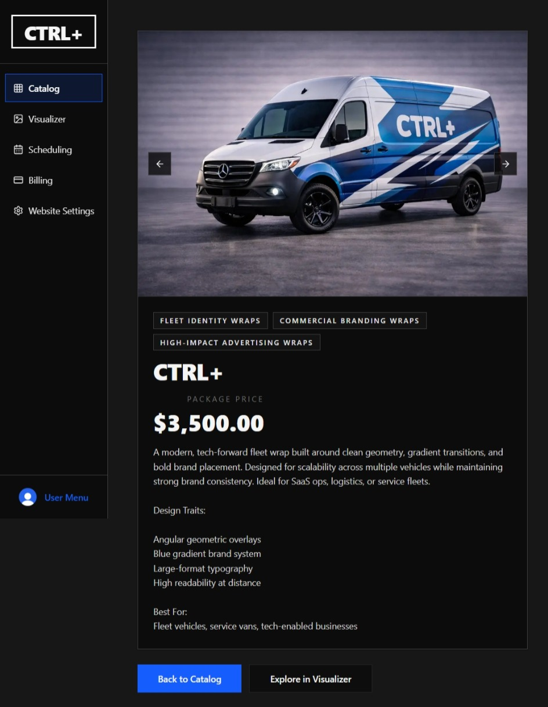
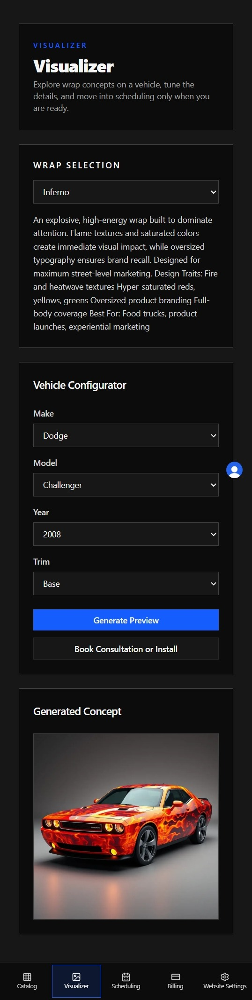

<!-- CtrlPlus - Vehicle Wrap Operations Platform -->

<p align="center">
  
</p>

<h1 align="center">CtrlPlus</h1>

<p align="center">
  <b>Modern, Tenant-Scoped Operations Platform for Vehicle Wrap Businesses</b><br/>
  <a href="#features">Features</a> • <a href="#tech-stack">Tech Stack</a> • <a href="#getting-started">Getting Started</a> • <a href="#architecture">Architecture</a> • <a href="#codebase-metrics">Metrics</a>
</p>

<p align="center">
  <a href="https://opensource.org/licenses/MIT"></a>
  
  
  
  
  
  
  
  
  
  
  
  
</p>

[!NOTE] **CtrlPlus** is a comprehensive operations platform designed specifically for vehicle wrap businesses. Manage your entire business - from catalog and design visualization to customer scheduling and billing - in a single, powerful system. Built with Next.js 16, React 19, Prisma ORM, and Neon Postgres.

## Features

- **Catalog Management:** Discover and manage wrap inventory with detailed specs, pricing, and availability
- **Design Visualization:** Advanced visualizer for previewing wraps on vehicles before installation
- **Scheduling & Operations:** Integrated booking tools for managing appointments and team coordination
- **Billing & Payments:** Stripe-backed invoicing, payments, and customer account management
- **Tenant-Scoped Operations:** Secure, isolated environments for each business
- **Mobile-First Design:** Optimized experience on any device with touch-friendly controls
- **Real-Time Updates:** Live synchronization across all platform features
- **Professional Reporting:** Comprehensive insights into business performance
- **Enterprise Security:** Clerk-powered authentication and role-based access control
- **Admin & Governance:** Moderation, operational insights, and business analytics

## Tech Stack

| Layer             | Technologies                                              |
| :---------------- | :-------------------------------------------------------- |
| Frontend          | Next.js 16 App Router, React 19, TypeScript, Tailwind CSS |
| Backend           | Node.js, Server Actions, API Routes                       |
| Identity & Auth   | Clerk (org-scoped, RBAC)                                  |
| Database          | PostgreSQL (Neon), Prisma ORM                             |
| Payments          | Stripe                                                    |
| Scheduling        | Server-first orchestration, workflow management           |
| Testing & Quality | Vitest, Playwright, ESLint, TypeScript type-checking      |

<p align="center">
  
</p>

## Getting Started

### Prerequisites

[!IMPORTANT] Ensure you have the following installed and configured before running the project:

- Node.js 18+
- pnpm 8+
- Neon Postgres database
- Clerk account

### Quickstart

```powershell
git clone https://github.com/DigitalHerencia/CtrlPlus.git
cd CtrlPlus
pnpm install
Copy-Item .env.example .env.local
Copy-Item .env.example .env
pnpm exec prisma generate
pnpm dev
```

Open [http://localhost:3000](http://localhost:3000)

### Quality Assurance

[!TIP] Run the following commands to ensure code quality and correctness:

```powershell
pnpm lint          # ESLint code quality
pnpm typecheck     # TypeScript type checking
pnpm prisma:validate  # Prisma schema validation
pnpm test          # Run Vitest unit tests
pnpm test:e2e      # Run Playwright end-to-end tests
pnpm build         # Production build
```

## Architecture

### Guardrails & Principles

- **Route-Focused**: `app/**` orchestration only (no business logic)
- **Data Access Layers**:
    - All reads → `lib/fetchers/{domain}`
    - All writes → `lib/actions/{domain}`
- **Server-Side Security**: Auth, tenancy, ownership, and capability checks
- **Component Reuse**: `components/ui/**` for shared primitives; `components/{domain}/**` for domain-specific UI
- **Capability-Based Access Control**: Fine-grained permission system for all sensitive operations

### Project Structure

```
CtrlPlus/
├── app/                    # Next.js App Router
│   ├── (auth)/            # Auth routes (Clerk-integrated)
│   ├── (tenant)/          # Tenant-scoped workspace
│   │   ├── admin/         # Admin dashboard & moderation
│   │   ├── billing/       # Invoicing & payments
│   │   ├── catalog/       # Wrap catalog management
│   │   ├── platform/      # Platform settings
│   │   ├── scheduling/    # Booking & operations
│   │   ├── settings/      # Organization configuration
│   │   └── visualizer/    # Design preview engine
│   └── api/               # API endpoints & webhooks
├── components/
│   ├── ui/                # Shared UI primitives
│   └── {domain}/          # Domain-specific components
├── lib/
│   ├── actions/           # Server actions (mutations)
│   ├── fetchers/          # Data fetchers (queries)
│   ├── auth/              # Auth utilities
│   ├── authz/             # Authorization policies
│   ├── db/                # Database helpers
│   └── integrations/      # Third-party integrations
├── features/              # Feature modules
├── schemas/               # Zod validation schemas
└── types/                 # Shared TypeScript types
```

## Codebase Metrics

<div>

### File Counts

| Metric                               |      Count |
| :----------------------------------- | ---------: |
| Tracked files (codebase)             |    **684** |
| All files on disk (excluding .git)   | **52,614** |
| Directories on disk (excluding .git) | **10,689** |

### File Type Breakdown

| Extension |  Count  | Percentage |
| :-------- | :-----: | ---------: |
| `.tsx`    | **432** |      63.2% |
| `.ts`     | **158** |      23.1% |
| `.md`     |   36    |       5.3% |
| `.sql`    |   14    |       2.0% |
| `.png`    |    9    |       1.3% |
| `.json`   |    8    |       1.2% |
| `.yaml`   |    7    |       1.0% |
| `.mjs`    |    3    |       0.4% |
| `.yml`    |    3    |       0.4% |

### Line Counts

| Metric                                      |      Lines |
| :------------------------------------------ | ---------: |
| Total lines (tracked files)                 | **50,996** |
| Non-empty lines                             | **42,974** |
| Source-only lines (configured code or text) | **50,736** |

**Quick Stats:**

- **TS/TSX Combined = 590 files (~86.3% of tracked files)**
- **Component & Feature Code = ~590 files**

[!NOTE] Line totals are physical line counts (not comment-adjusted)

<span style="display:inline-block; margin-top:20px;">



</span>

</div>

## Development Workflow

### Branch Naming

- `feature/xyz` – New features
- `fix/abc` – Bug fixes
- `docs/doc-change` – Documentation updates
- `refactor/xyz` – Code refactoring

### PR Guidelines

- **Title Format:** `[type]: description` (e.g., `feat: add visualizer preview`)
- **Type Options:** `feat`, `fix`, `docs`, `refactor`, `test`, `chore`
- **Template:** Use [pull_request_template.md](.github/pull_request_template.md)

## Help & Support

- **Documentation:** See `/docs` for user guides and technical references
- **Contributing:** See [CONTRIBUTING.md](./CONTRIBUTING.md) for full guidelines
- **Issues:** Report bugs or request features on [GitHub Issues](https://github.com/DigitalHerencia/CtrlPlus/issues)

## License

MIT License. See [LICENSE](LICENSE) for details.

---

<p align="center">
  <b>CtrlPlus - Professional vehicle wrap operations made simple.</b>
</p>

<!-- End of README -->
