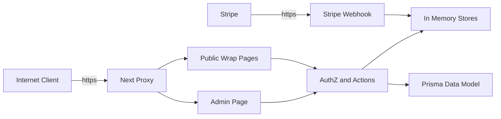

## Executive summary
This repository models a multi-tenant Next.js platform for catalog browsing, scheduling, and Stripe-backed billing, but the current runtime trust model is not aligned with its stated security requirements. The highest-risk themes are (1) authentication and authorization decisions based on client-controlled headers, (2) tenant-context drift caused by fallback tenant resolution and caller-supplied `tenantId` values in mutation functions, and (3) payment-state integrity risks in the Stripe webhook path due to a default shared secret and non-persistent idempotency. These issues can enable unauthorized admin access, cross-tenant data integrity violations, and fraudulent invoice state transitions.

## Scope and assumptions
- **In scope (runtime):** `proxy.ts`, `app/(tenant)/**`, `app/api/stripe/webhook/route.ts`, `lib/server/**`, `features/**` used by server paths, and tenant/payment schema definitions in `prisma/schema.prisma`.
- **In scope (security posture evidence):** intended auth/tenancy rules in `docs/tech-requirements.md` and product security goals in `docs/product-requirements.md`.
- **Out of scope:** CI workflow hardening (`.github/workflows/**`), local developer tooling, and test-only harness behavior except where tests document intended controls.
- **Assumption 1:** Internet traffic reaches this app over HTTPS and includes direct requests from non-browser clients (curl/Postman/automation), not only browser navigation.
- **Assumption 2:** Current auth header parsing (`x-user-*`, `x-clerk-user-*`) is part of runtime behavior and not fully replaced by Clerk server SDK checks yet.
- **Assumption 3:** Server action modules in `lib/server/actions/**` are or will be exposed through route handlers/server actions in production workflows.
- **Assumption 4:** Stripe webhook endpoint remains public internet-facing.

Open questions that materially affect ranking:
- Is a trusted edge/auth proxy stripping and re-injecting identity headers before requests reach Next.js?
- Are `lib/server/actions/**` entry points currently exposed to end users, or still internal-only scaffolding?
- Is the production deployment single-tenant-per-domain or true multi-tenant subdomain routing in one deployment?

## System model
### Primary components
- **Tenant gate + security headers:** `proxy()` resolves tenant from host and applies CSP/HSTS and related headers (`proxy.ts`).
- **Public tenant catalog pages:** wraps list/detail pages resolve tenant and fetch published wraps (`app/(tenant)/wraps/page.tsx`, `app/(tenant)/wraps/[id]/page.tsx`, `lib/server/fetchers/catalog/get-public-wraps.ts`).
- **Admin page surface:** admin dashboard reads request headers, enforces `admin:read`, and loads wrap/booking/invoice metrics (`app/(tenant)/admin/page.tsx`).
- **AuthN/AuthZ guards:** `requireAuth()` and `requirePermission()` derive identity/role from request headers (`lib/server/auth/require-auth.ts`, `lib/server/auth/require-permission.ts`, `features/authz/permissions.ts`).
- **Billing webhook:** Stripe webhook validates a signature and marks invoices paid (`app/api/stripe/webhook/route.ts`, `lib/server/fetchers/get-invoice.ts`).
- **Domain state stores:** booking, catalog, invoice, upload, and rate-limit state are in-process memory maps (`lib/server/fetchers/**`, `lib/server/storage/upload-store.ts`, `lib/server/rate-limit/fixed-window-limiter.ts`).
- **Data model intent:** Prisma schema defines tenant-scoped persistent entities and unique payment event IDs (`prisma/schema.prisma`).

### Data flows and trust boundaries
- **TB-1: Internet Client -> Next Proxy**
  - Data: `Host`, `x-forwarded-host`, request headers/cookies.
  - Channel: HTTPS HTTP request.
  - Security guarantees: tenant host required via `requireTenant()`; unknown tenant returns 404; response security headers (CSP, HSTS, frame deny).
  - Validation: host normalization/subdomain parsing in tenancy resolver.
- **TB-2: Next Proxy -> Tenant Pages**
  - Data: routed request context and resolved tenant from host.
  - Channel: in-process Next.js routing.
  - Security guarantees: route access depends on downstream guards.
  - Validation: `getRequestTenant()` resolves from host but falls back to `tenant_acme` when unresolved.
- **TB-3: Request Headers -> AuthN/AuthZ Guards**
  - Data: `x-clerk-user-id`, `x-user-id`, `x-user-role`, `x-user-email`.
  - Channel: server-side header map parsing.
  - Security guarantees: presence/format checks and role-permission matrix.
  - Validation: no cryptographic/session validation of header provenance.
- **TB-4: Tenant/Admin routes -> Action/Fetcher layer**
  - Data: tenant IDs, booking/invoice/catalog mutation payloads.
  - Channel: in-process function calls.
  - Security guarantees: permission checks exist; tenant scoping inconsistently derived.
  - Validation: business validation for email, slot overlap, upload type/size.
- **TB-5: Stripe -> Webhook endpoint**
  - Data: signed event payload and metadata (`tenantId`, `invoiceId`).
  - Channel: HTTPS POST to `/api/stripe/webhook`.
  - Security guarantees: custom HMAC check with `stripe-signature` and timing-safe compare.
  - Validation: parses JSON and updates invoice status; idempotency only in memory set.
- **TB-6: App logic -> State stores / database model**
  - Data: tenant records, invoices, bookings, uploads, rate-limit counters.
  - Channel: in-process maps today; Prisma schema for persistent DB intent.
  - Security guarantees: tenant filters in store methods and schema indexes.
  - Validation: no persistent, cross-instance consistency for counters/event dedupe in current runtime code.

#### Diagram

## Assets and security objectives
| Asset | Why it matters | Security objective (C/I/A) |
|---|---|---|
| Tenant-scoped business data (wraps, bookings, invoices) | Cross-tenant leakage or tampering harms customers and operations | C, I |
| Invoice/payment state | Fraudulent `paid` state causes direct financial loss and bad fulfillment decisions | I, A |
| Auth context (user identity + role) | Governs admin/catalog/billing writes; compromise leads to full control | C, I |
| Stripe webhook secret | Verifies payment authority; secret loss enables forged payment events | C, I |
| Upload processing path and memory | Abuse can degrade preview availability and increase cost | A |
| Tenant routing context (`host` -> `tenantId`) | Wrong tenant resolution breaks isolation guarantees | C, I |
| Audit/idempotency event records | Needed to prevent replay and support incident forensics | I, A |

## Attacker model
### Capabilities
- Send arbitrary HTTP requests directly to public endpoints (including custom headers and non-browser traffic patterns).
- Choose request timing and volume to probe rate limits and in-memory exhaustion behavior.
- Upload crafted files within accepted mime/type boundaries.
- Replay previously captured webhook payloads/signatures if secret handling is weak.
- Enumerate tenant subdomains from known slugs or DNS patterns.

### Non-capabilities
- Does not break TLS cryptography or read in-transit encrypted traffic.
- Cannot forge valid Stripe signatures without webhook secret (unless default/fallback secret is used).
- Does not assume direct shell/database access to production host.
- Does not assume compromise of Vercel/GitHub control plane in this model.

## Entry points and attack surfaces
| Surface | How reached | Trust boundary | Notes | Evidence (repo path / symbol) |
|---|---|---|---|---|
| Tenant proxy gate | Any non-static request path | TB-1 | Applies tenant resolution and security headers to most routes | `proxy.ts:proxy`, `proxy.ts:config.matcher`, `lib/server/tenancy/require-tenant.ts:requireTenant` |
| Public wraps listing/detail | `GET /wraps`, `GET /wraps/:id` | TB-2 | Resolves tenant from host; cached public wrap fetchers | `app/(tenant)/wraps/page.tsx:WrapsPage`, `app/(tenant)/wraps/[id]/page.tsx:WrapDetailsPage`, `lib/server/fetchers/catalog/get-public-wraps.ts:getPublicWraps` |
| Admin dashboard | `GET /admin` | TB-3, TB-4 | Authorization is derived from request headers through `requirePermission` | `app/(tenant)/admin/page.tsx:AdminDashboardPage`, `lib/server/auth/require-permission.ts:requirePermission` |
| Stripe webhook | `POST /api/stripe/webhook` | TB-5 | Validates signature and marks invoice paid | `app/api/stripe/webhook/route.ts:POST`, `lib/server/fetchers/get-invoice.ts:markPaid` |
| Mutation action layer | Internal/server action wiring | TB-4, TB-6 | Mutations accept caller-provided `tenantId` inputs | `lib/server/actions/create-booking.ts:createBooking`, `lib/server/actions/create-invoice.ts:createInvoice`, `lib/server/actions/catalog/create-wrap-design.ts:createWrapDesign` |
| Upload preview pipeline | Internal/server action wiring | TB-4, TB-6 | Enforces mime/signature/size checks and fixed-window rate limit | `lib/server/actions/create-upload-preview.ts:createUploadPreviewAction`, `lib/server/storage/upload-store.ts:save`, `lib/server/rate-limit/fixed-window-limiter.ts:consume` |

## Top abuse paths
1. **Forged admin identity via headers -> unauthorized operations**
   1) Attacker sends request with `x-user-id`, `x-user-email`, `x-user-role: owner`. 2) `requireAuth`/`requirePermission` trusts header values. 3) Attacker accesses admin data and any exposed privileged mutation path. 4) Impact: unauthorized tenant data access and integrity compromise.
2. **Cross-tenant mutation through caller-supplied `tenantId`**
   1) Attacker reaches a write action endpoint. 2) Supplies victim `tenantId` in action payload. 3) Permission check passes based on forged/stolen role context. 4) Catalog/booking/invoice state mutates for wrong tenant.
3. **Tenant confusion via fallback resolution**
   1) Request path executes `getRequestTenant()` where host resolution fails or is bypassed. 2) Code falls back to `tenant_acme`. 3) Data returned/modified in unintended tenant context.
4. **Webhook forgery when secret fallback is active**
   1) Deployment misses `STRIPE_WEBHOOK_SECRET`. 2) App uses default `stripe_test_secret`. 3) Attacker signs arbitrary payload and sets invoice metadata. 4) Invoice marked `paid` without real Stripe payment.
5. **Webhook replay and duplicate processing across instances**
   1) Valid webhook payload is replayed. 2) In-memory dedupe set is cold/isolated per instance. 3) Event reprocessed or inconsistently processed across workers. 4) Operational inconsistency and noisy billing state transitions.
6. **Upload resource exhaustion despite per-key limiter**
   1) Attacker rotates spoofed `x-user-id` values. 2) Bypasses tenant+user keyed fixed-window limits. 3) Sends many near-5MB uploads. 4) Increased memory/CPU pressure and degraded preview service.
7. **Malformed payload error amplification**
   1) Attacker submits malformed JSON/date payloads. 2) Parsing/validation throws uncaught errors in webhook or scheduling compute paths. 3) Elevated 500 rates and potential retry storms.

## Threat model table
| Threat ID | Threat source | Prerequisites | Threat action | Impact | Impacted assets | Existing controls (evidence) | Gaps | Recommended mitigations | Detection ideas | Likelihood | Impact severity | Priority |
|---|---|---|---|---|---|---|---|---|---|---|---|---|
| TM-001 | External attacker | Can send direct HTTP requests with custom headers to app routes. | Forge `x-user-id` / `x-user-email` / `x-user-role` to satisfy authz checks and access privileged surfaces. | Unauthorized admin access, data tampering, potential cross-tenant access through downstream actions. | Auth context, tenant business data, invoices/bookings/catalog. | Role matrix and permission checks exist (`features/authz/permissions.ts`, `lib/server/auth/require-permission.ts`). | Identity source is client-controlled headers; no Clerk session verification despite requirements. | Replace header trust with Clerk server-side session validation; derive role from DB membership; reject external `x-user-*` headers at edge; enforce signed internal identity context only. | Alert on requests containing `x-user-role` from public internet; monitor privilege escalations by IP/device fingerprint; log auth source (`session` vs `header`). | high | high | critical |
| TM-002 | External attacker / misconfiguration | Route executes tenant resolution without trusted host context. | Trigger unresolved host path and rely on fallback tenant assignment (`tenant_acme`). | Tenant confusion and possible cross-tenant data disclosure/integrity issues. | Tenant routing context, tenant business data. | Proxy enforces `requireTenant()` and blocks unknown hosts (`proxy.ts`, `lib/server/tenancy/require-tenant.ts`). | `getRequestTenant()` silently falls back to a real tenant when host cannot be resolved. | Remove hardcoded fallback in production; fail closed when tenant cannot be resolved; assert proxy-tenant and page-tenant consistency; add integration tests for unknown host on all tenant routes. | Track unresolved host resolutions and fallback executions; alert on non-zero fallback events in production. | medium | high | high |
| TM-003 | External attacker with forged or stolen privilege context | Access to mutation endpoints using action layer and ability to provide payload `tenantId`. | Submit victim `tenantId` in create/update/delete payloads to mutate another tenant’s data. | Cross-tenant integrity compromise and unauthorized business workflow changes. | Catalog, booking, invoice records; tenant isolation guarantees. | Some store operations filter by tenant on reads/updates (`lib/server/fetchers/catalog/store.ts`, `lib/server/fetchers/get-invoice.ts`). | Mutation APIs accept caller-supplied `tenantId` without binding to resolved tenant context; requirement says client tenantId must be ignored. | Remove external `tenantId` parameters from mutation APIs; bind tenant from trusted request context (`requireTenant`) and enforce `routeTenantId` equivalence; add centralized tenant guard for all actions/fetchers. | Log tenant mismatch attempts (`payload tenantId` vs resolved tenant); alert on mismatch rate spikes. | medium | high | high |
| TM-004 | External attacker | Missing/weak webhook secret handling or secret leakage. | Forge signed Stripe webhook payload to mark invoices paid without successful payment. | Financial fraud and incorrect fulfillment decisions. | Invoice/payment state, revenue integrity, customer trust. | HMAC signature check + timing-safe compare exists (`app/api/stripe/webhook/route.ts:isValidStripeSignature`). | Default fallback secret (`stripe_test_secret`), no Stripe timestamp verification, no Stripe API reconciliation of session/payment intent before marking paid. | Fail startup if `STRIPE_WEBHOOK_SECRET` absent; use official Stripe SDK webhook verification with timestamp tolerance; verify event/session against Stripe API and expected invoice amount/tenant mapping before `markPaid`. | Alert on payment events in deployments using fallback/default secret; monitor paid transitions where checkout session was not previously opened. | medium | high | critical |
| TM-005 | External attacker / botnet | Can generate high-volume upload requests and vary user-id headers. | Bypass per-key limiter by rotating spoofed IDs; flood upload processing with near-limit files. | Availability degradation and resource exhaustion. | Upload pipeline availability, server memory/CPU budget. | Upload validation (mime/ext/signature/size) and fixed-window limiter exist (`lib/server/storage/upload-store.ts`, `lib/server/rate-limit/fixed-window-limiter.ts`). | Rate-limit key uses caller-provided user header; limiter and stores are in-memory and reset per instance. | Apply edge/global limits by IP + tenant + authenticated principal; use durable shared limiter (Redis/Upstash); add request body caps at gateway; require verified identity for high-cost endpoints. | Track 429 rates by tenant/IP, upload byte volume, and unique spoofed user-id cardinality; alert on sudden cardinality spikes. | high | medium | medium |
| TM-006 | External attacker | Can send malformed payloads to webhook and scheduling-related endpoints. | Trigger unhandled parsing/validation exceptions (`JSON.parse`, invalid ISO/time window) to generate 500s and retries. | Reduced availability and noisy operations/monitoring. | Service availability, incident response signal quality. | Basic field checks exist in invoice/upload paths. | No explicit safe parsing/error normalization around webhook JSON parse and compute slot exceptions in caller boundary. | Add schema validation (Zod) at all external boundaries; catch/normalize parse errors to 400-class responses; add circuit-breakers for repeated malformed traffic. | Dashboard malformed-request counters, 4xx/5xx ratio by route, and repeat offender IPs. | medium | medium | medium |

## Criticality calibration
- **Critical (repo-specific):** unauthorized changes that directly alter payment truth or grant broad privileged access across tenant boundaries.
  - Examples: forged role headers yielding admin-level access (`TM-001`), forged Stripe webhook payment completion (`TM-004`), combined forged auth + tenant override across writes (`TM-001` + `TM-003`).
- **High:** realistic paths that violate tenant isolation or materially alter business state, but with stronger preconditions or partial controls.
  - Examples: tenant fallback confusion causing wrong-tenant context (`TM-002`), cross-tenant mutation where action endpoint exposure exists (`TM-003`), replay-driven inconsistent billing events across workers.
- **Medium:** attacks causing significant reliability/operational pain without immediate broad confidentiality/integrity collapse.
  - Examples: upload flood with spoofed IDs (`TM-005`), malformed payload induced 500 bursts (`TM-006`), schedule input abuse causing repeated exception churn.
- **Low:** limited-blast-radius issues with strong compensating controls and low business impact.
  - Examples: blocked upload path traversal attempts already rejected by filename checks, unsupported mime uploads rejected pre-processing, viewer-role overreach blocked by permission matrix.

## Focus paths for security review
| Path | Why it matters | Related Threat IDs |
|---|---|---|
| `lib/server/auth/require-auth.ts` | Authentication currently trusts caller-provided headers directly. | TM-001 |
| `lib/server/auth/require-permission.ts` | Authorization role is derived from request headers and defaults to viewer when absent. | TM-001, TM-003 |
| `features/authz/permissions.ts` | Defines privilege boundaries and role capability blast radius. | TM-001 |
| `app/(tenant)/admin/page.tsx` | High-value admin data surface gated by the current auth model. | TM-001, TM-003 |
| `lib/server/tenancy/get-request-tenant.ts` | Fallback tenant behavior can silently break isolation assumptions. | TM-002 |
| `lib/server/tenancy/require-tenant.ts` | Primary tenant isolation control at request boundary. | TM-002, TM-003 |
| `proxy.ts` | Global trust boundary enforcement and security-header policy. | TM-002 |
| `lib/server/actions/create-invoice.ts` | Billing mutations accept caller tenant context; financial workflow entry point. | TM-003 |
| `lib/server/actions/create-checkout-session.ts` | Creates payment session and binds invoice to checkout context. | TM-003, TM-004 |
| `app/api/stripe/webhook/route.ts` | Payment integrity boundary; signature verification and idempotency behavior live here. | TM-004, TM-006 |
| `lib/server/fetchers/get-invoice.ts` | `markPaid` is final payment-state transition function. | TM-004 |
| `lib/server/actions/create-upload-preview.ts` | Upload abuse path and rate-limit key derivation from headers. | TM-005 |
| `lib/server/storage/upload-store.ts` | Input validation and resource constraints for file uploads. | TM-005 |
| `lib/server/rate-limit/fixed-window-limiter.ts` | In-memory limiter behavior and bypass conditions. | TM-005 |
| `prisma/schema.prisma` | Intended durable tenant and payment event integrity model not fully wired into runtime logic. | TM-003, TM-004 |
| `docs/tech-requirements.md` | Security intent baseline used to identify implementation gaps. | TM-001, TM-003 |

## Quality check
- Covered all discovered runtime entry points: proxy, tenant pages, admin page, webhook, and mutation/upload action layer.
- Represented each trust boundary (TB-1 through TB-6) in at least one abuse path and one threat table entry.
- Separated runtime threats from CI/dev concerns; CI is explicitly out of scope for this report.
- Explicit assumptions and open questions are listed; rankings for TM-002 and TM-003 are most sensitive to these assumptions.
- Existing controls vs gaps are evidence-anchored to repository paths/symbols rather than generic controls.
